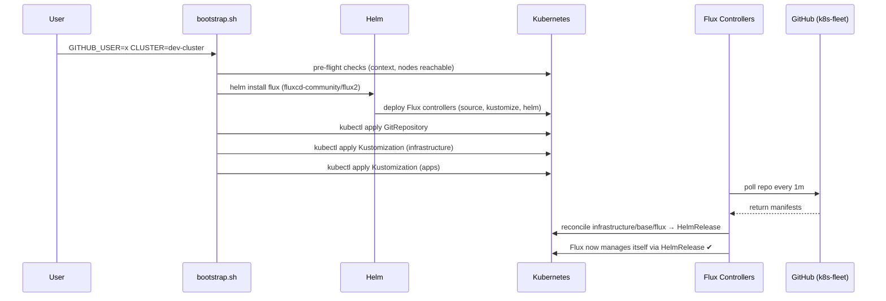
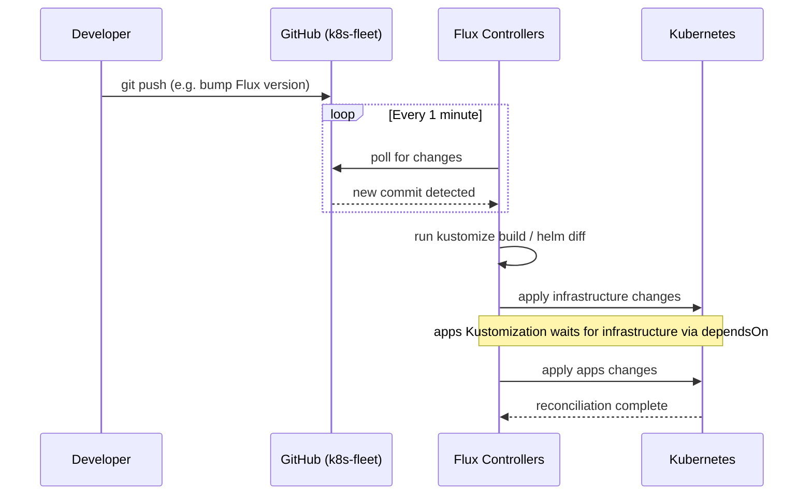

# k8s-fleet

GitOps source of truth for Kubernetes clusters managed by [Flux](https://fluxcd.io). Flux itself is installed as a `HelmRelease` — upgrading Flux across all clusters is a single version bump in git.

## Repository structure

```
k8s-fleet/
├── bootstrap/
│   └── bootstrap.sh            # One-time bootstrap script (any cluster)
├── clusters/
│   └── dev-cluster/            # One directory per cluster
│       ├── gitrepository.yaml  # GitRepository pointing at this repo
│       ├── infrastructure.yaml # Flux Kustomization → infrastructure/<cluster>
│       └── apps.yaml           # Flux Kustomization → apps/<cluster>
├── infrastructure/
│   ├── base/
│   │   ├── flux/                        # Flux controllers as a HelmRelease (shared)
│   │   │   ├── namespace.yaml
│   │   │   ├── helmrepository.yaml
│   │   │   ├── helmrelease.yaml
│   │   │   └── kustomization.yaml
│   │   └── external-repo-template/      # Copy this to add any external git repo
│   │       ├── gitrepository.yaml
│   │       ├── flux-kustomization.yaml
│   │       └── kustomization.yaml
│   └── dev-cluster/                     # Cluster-specific overlay
│       └── kustomization.yaml
└── apps/
    ├── base/                   # Shared app definitions
    └── dev-cluster/            # Cluster-specific overlay
```

**Key design decisions:**
- `infrastructure/base/` is shared across all clusters — add infra components once, reuse everywhere
- Each `clusters/<name>/` directory is lightweight — just the GitRepository + two Kustomizations
- `apps` depends on `infrastructure` via `dependsOn`, so Flux installs infra first

## How to add a new cluster

```bash
# 1. Create the cluster overlay directories
mkdir -p clusters/<name> infrastructure/<name> apps/<name>

# 2. Copy the dev-cluster overlays as a starting point
cp clusters/dev-cluster/*.yaml clusters/<name>/
cp infrastructure/dev-cluster/kustomization.yaml infrastructure/<name>/
cp apps/dev-cluster/kustomization.yaml apps/<name>/

# 3. Update clusters/<name>/gitrepository.yaml — change branch or path if needed

# 4. Bootstrap
GITHUB_USER=<you> CLUSTER=<name> CLUSTER_CONTEXT=<kubectl-context> ./bootstrap/bootstrap.sh
```

## How it works

### Bootstrap sequence (one-time)



### Ongoing GitOps reconciliation loop



## Bootstrap a cluster (first time)

Prerequisites:
- Cluster is running and `kubectl` context is set
- This repo is pushed to GitHub as `https://github.com/<GITHUB_USER>/k8s-fleet`
- `helm`, `flux`, `envsubst` installed (`brew install helm fluxcd/tap/flux gettext`)

```bash
export GITHUB_USER=<your-github-username>
export CLUSTER=dev-cluster                    # matches clusters/<name>/
export CLUSTER_CONTEXT=k3d-dev-cluster        # kubectl context name

./bootstrap/bootstrap.sh
```

Or from `k8s-colima-cluster`:
```bash
GITHUB_USER=<you> make flux-bootstrap
```

## Adding a component from an external Git repo

Use `infrastructure/base/external-repo-template/` as a starting point. Flux will watch the external repo and reconcile changes automatically.

```bash
# 1. Copy the template
cp -r infrastructure/base/external-repo-template infrastructure/base/my-component

# 2. Edit the three COMPONENT_NAME / URL placeholders
#    - gitrepository.yaml      → set name and url
#    - flux-kustomization.yaml → set name and path (path inside the external repo)

# 3. Register it in the base infrastructure kustomization
echo "  - my-component/" >> infrastructure/base/kustomization.yaml

# 4. Push — Flux picks it up automatically
```

**If the external repo is private**, create an auth secret first:

```bash
flux create secret git my-component-auth \
  --url=https://github.com/owner/repo \
  --username=git \
  --password=$GITHUB_TOKEN
```

Then uncomment `secretRef` in `gitrepository.yaml`.

---

## Upgrading Flux

Edit `infrastructure/base/flux/helmrelease.yaml`, bump the `version` field, and push. Flux reconciles and upgrades itself on all clusters that use this repo.

```yaml
version: ">=2.8.0 <3.0.0"   # bump this
```

## Why this repo is separate from k8s-colima-cluster

This repo defines what runs on clusters (Flux GitOps). [k8s-colima-cluster](https://github.com/Sifungurux/k8s-colima-cluster) provisions the local cluster (Colima + k3d). They are intentionally kept as two separate repos.

**Pros of keeping them separate**
- This repo is cluster-agnostic — it can manage a local dev cluster, a staging cloud cluster, or both; any cluster can be bootstrapped by pointing Flux at this repo
- Flux watches this repo only; no need to filter out unrelated shell scripts and Colima configs
- Different change frequencies — provisioning scripts change rarely, GitOps manifests change often
- This layer can be shared or open-sourced independently of local machine setup

**Cons (why you might consider merging)**
- Two repos to clone and maintain
- `FLUX_GITOPS_DIR` in `k8s-colima-cluster`'s Makefile must point at the correct local path for this repo
- Extra context switching for a solo developer

> **Verdict:** keep them separate. The split pays off as soon as you add a second cluster (staging, CI, etc.) — this repo scales to manage all of them while `k8s-colima-cluster` stays focused on local dev setup.

## Day-to-day commands

```bash
flux get all -A                          # all Flux resources across namespaces
flux logs --all-namespaces               # reconciliation logs
flux reconcile kustomization infrastructure  # force sync infra now
flux reconcile kustomization apps            # force sync apps now
kubectl get helmrelease -n flux-system   # Flux's own HelmRelease status
```
